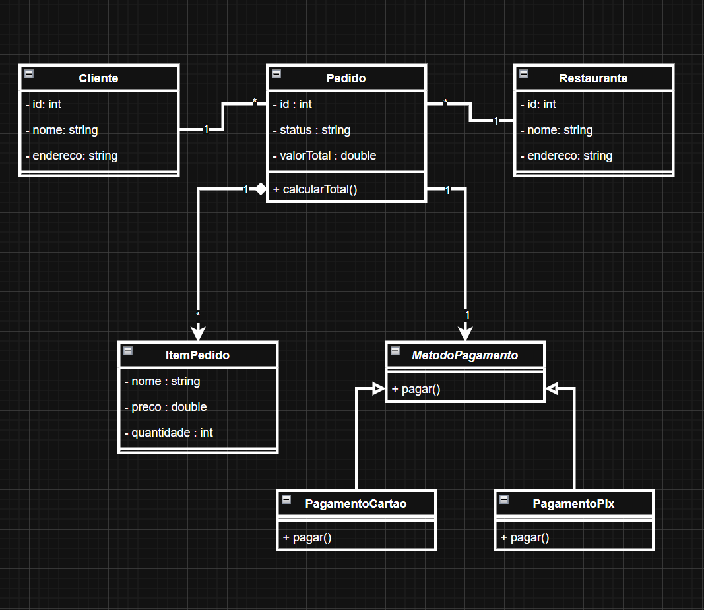

# Sistema de Delivery - Aplicação de Princípios SOLID e GRASP

Este é um projeto para demonstrar a aplicação de princípios de engenharia de software no projeto de um sistema de delivery.

O sistema modela uma plataforma de delivery, onde clientes podem realizar pedidos em restaurantes e escolher diferentes métodos de pagamento.

---

## Funcionalidades do Sistema

* Cadastro de clientes
* Registro de restaurantes
* Criação de pedidos
* Adição de itens ao pedido
* Processamento de pagamento por diferentes métodos

---

## Diagrama de Classes

---

## Princípios SOLID Aplicados

### SRP — Single Responsibility Principle

Cada classe do sistema possui uma única responsabilidade.
Por exemplo:

* `Cliente` representa os dados e ações relacionadas ao cliente.
* `Pedido` gerencia as informações e cálculos relacionados a um pedido.
* `ItemPedido` representa um item específico dentro de um pedido.
* `MetodoPagamento` define a estrutura para processamento de pagamentos.

---

### OCP — Open/Closed Principle

O sistema foi projetado para permitir a adição de novos métodos de pagamento sem modificar as classes existentes.

Isso é demonstrado pela classe `MetodoPagamento`, que serve como base para diferentes implementações, como:

* `PagamentoPix`
* `PagamentoCartao`

Novos métodos de pagamento podem ser adicionados simplesmente criando novas classes que estendam `MetodoPagamento`.

---

### LSP — Liskov Substitution Principle

As subclasses de `MetodoPagamento` podem substituir a classe base sem alterar o comportamento esperado do sistema.
Por exemplo:

* `PagamentoPix` pode ser utilizado em qualquer lugar onde `MetodoPagamento` é esperado.
* `PagamentoCartao` também pode ser utilizado da mesma forma.

Isso garante que o sistema funcione corretamente independentemente do tipo específico de pagamento utilizado.

---

## Padrões GRASP Aplicados

### Information Expert

O padrão Information Expert foi aplicado na classe `Pedido`, que possui o método `calcularTotal()`.
Como o pedido contém os itens (`ItemPedido`), ele possui as informações necessárias para calcular o valor total, sendo o mais adequado para essa responsabilidade.

---

### Creator

O padrão Creator é observado na relação entre `Pedido` e `ItemPedido`.
Como o pedido agrega vários itens, faz sentido que ele seja responsável pela criação dos objetos `ItemPedido`.

---

### Polymorphism

O padrão Polymorphism foi aplicado na classe `MetodoPagamento`, que define o método `pagar()`.
As subclasses `PagamentoPix` e `PagamentoCartao` implementam esse método de formas diferentes, permitindo variação de comportamento sem alterar o código existente.

---

### Low Coupling

O sistema apresenta baixo acoplamento, pois a classe `Pedido` depende da abstração `MetodoPagamento`, e não de implementações específicas como `PagamentoPix` ou `PagamentoCartao`.

---

### High Cohesion

As classes possuem alta coesão, pois cada uma tem uma responsabilidade bem definida.
Por exemplo:

* `Pedido` gerencia informações do pedido
* `ItemPedido` representa apenas os itens
* `MetodoPagamento` trata exclusivamente do pagamento

---
