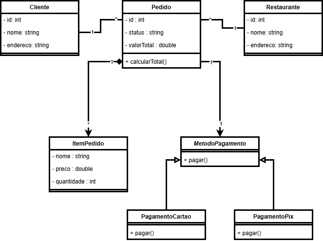

# Sistema de Delivery - Aplicação dos Princípios SOLID

Este é um projeto para demonstrar a aplicação de alguns princípios SOLID no projeto de um sistema de software.

O sistema modela uma plataforma de delivery, como o iFood, onde clientes podem realizar pedidos em restaurantes e escolher diferentes métodos de pagamento.

---

## Funcionalidades do Sistema

* Cadastro de clientes
* Registro de restaurantes
* Criação de pedidos
* Adição de itens ao pedido
* Processamento de pagamento por diferentes métodos

---

## Diagrama de Classes

---

## Princípios SOLID Aplicados

### SRP — Single Responsibility Principle

Cada classe do sistema possui uma única responsabilidade.
Por exemplo:

* `Cliente` representa os dados e ações relacionadas ao cliente.
* `Pedido` gerencia as informações e cálculos relacionados a um pedido.
* `ItemPedido` representa um item específico dentro de um pedido.
* `MetodoPagamento` define a estrutura para processamento de pagamentos.

### OCP — Open/Closed Principle

O sistema foi projetado para permitir a adição de novos métodos de pagamento sem modificar as classes existentes.

Isso é demonstrado pela classe `MetodoPagamento`, que serve como base para diferentes implementações, como:

* `PagamentoPix`
* `PagamentoCartao`

Novos métodos de pagamento podem ser adicionados simplesmente criando novas classes que estendam `MetodoPagamento`.

### LSP — Liskov Substitution Principle

As subclasses de `MetodoPagamento` podem substituir a classe base sem alterar o comportamento esperado do sistema. Por exemplo:

* `PagamentoPix` pode ser utilizado em qualquer lugar onde `MetodoPagamento` é esperado.
* `PagamentoCartao` também pode ser utilizado da mesma forma.

Isso garante que o sistema funcione corretamente independentemente do tipo específico de pagamento utilizado.
